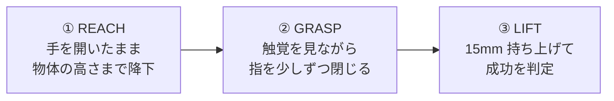
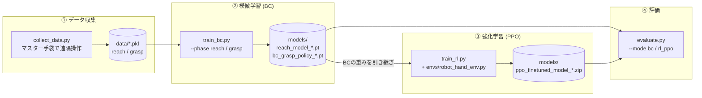

# 触覚フィードバック付き 5本指ロボットハンドの把持学習

**模倣学習 (BC) → 強化学習 (PPO) によるファインチューン**で、大きさや形の違う物体を自動で把持する5本指ロボットハンドのシステムです。
人がマスター手袋で操作したデータから学習し、実機上の強化学習で「把持成功」と「かける力の小ささ」を両立するように調整します。

<!-- 📷 画像: 実験環境の全体（マスター手袋 + スレーブハンド + CNCステージ + 触覚センサ + PC） -->
<p align="center">
  
</p>

## 動作の流れ

ハンドを物体の真上から下ろし、触覚を見ながら指を少しずつ閉じて、最後に持ち上げます。



1. **REACH（下ろす）**：物体サイズを入力すると、REACHモデルが降りる高さ（Z）を予測します。指を開いた状態（90°）のまま、CNCステージでハンドをその高さまで下ろします。到達したら触覚センサをゼロ点に合わせます。
2. **GRASP（つかむ）**：毎ステップ、指先3か所の触覚センサの力 Fz と、今の指の角度を見て、各指を **最大 ±5° ずつ** 動かします。この判断を100ステップ繰り返します。絶対角度ではなく角度変化を出力しているので、触覚データが細かく揺れても指が急に閉じず、滑らかにつかめます。
3. **LIFT（持ち上げる）**：100ステップ終わると自動で15mm持ち上げ、落とさずに保持できていれば成功です（強化学習では +50 の報酬）。

## 学習の流れ



すべて `main.py` のメニューから実行できます（`*` は `ball` / `cube` / `mix`）。

| ファイル | 役割 |
|---|---|
| `main.py` | メニュー（1: 収集 / 2: BC学習 / 3: PPO学習 / 5: 評価 / d: ダミーモード） |
| `scripts/collect_data.py` | マスター手袋＋キーボードでスレーブを操作し、REACH / GRASP の軌跡を20Hzで記録 |
| `scripts/train_bc.py` | REACH回帰モデルと GRASP の BC ポリシーを学習 |
| `scripts/train_rl.py` | BCの重みでPPOを初期化し、実機でファインチューン（ログ: `logs/*/rl_history.csv`） |
| `scripts/evaluate.py` | BC / PPO モデルで把持を10回試行し成功率を表示 |
| `envs/robot_hand_env.py` | Gymnasium環境（観測・行動・報酬の定義） |
| `hardware/hardware_interface.py` | マスター手袋・スレーブハンド・CNCステージ・触覚センサ3個のシリアル通信 |
| `arduino_code/` | マスター手袋 (`master_serial`) / スレーブハンド (`slave_serial`) のArduinoコード |

## モデルの入出力

<!-- 📷 画像: アーキテクチャ図（スライド「アーキテクチャの変更」） -->
<p align="center">
  
</p>

| | 入力 (観測) | 出力 (行動) |
|---|---|---|
| **REACH** | 物体サイズ（1次元） | 降下するZ高さ（1次元） |
| **GRASP** | 触覚センサFz ×3、物体サイズ、現在の指角度 ×5（計9次元） | 5指の角度変化 Δθ ∈ [-1, 1]（×5° / step） |

## アルゴリズムとハイパーパラメータ

| | REACH 回帰 | GRASP 模倣学習 | GRASP 強化学習 |
|---|---|---|---|
| アルゴリズム | MLP回帰 (PyTorch) | Behavior Cloning (`imitation`) | PPO (`stable-baselines3`) |
| ネットワーク | 1 →16→1| [32, 32] | [32, 32]（BCから初期化） |
| 学習率 | 0.01| 1e-3 | 1e-4 |
| バッチサイズ | 全データ | 64 | 64 |
| エポック / ステップ | 1000 epoch (MSE) | 500 epoch | n_steps 1024、実機で20エピソード |
| その他 | – | seed 42 | 1エピソード 100 step（その他はSB3デフォルト） |

**報酬設計（PPO）**
- 各ステップ：`-0.0001 × Σ|Fz|`（強く握りすぎを抑制）
- エピソード終了時：自動で15mm持ち上げ、成功なら `+50`

## 結果

教師データにない直径5cmの球や、置く向きで持ち方が変わる立方体も、触覚をもとに指を少しずつ閉じてつかみ、持ち上げられました。

<!-- 🎬 ここに動画のURLを貼る（GitHubの編集画面に動画をドラッグ&ドロップするとURLが入る） -->
https://github.com/user-attachments/assets/REPLACE_WITH_VIDEO_ID

## 動かし方

```bash
pip install -r requirements.txt
python main.py        # 実機なしで試す場合はメニューで「d」→ ダミーモード
```
